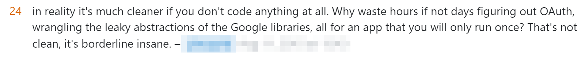

# google-sheets-fetch
Export a Google Sheets cell range to PDF

1. write data to excel
   1. throw if the annex for the current month is missing
2. export excel sheet via fetching URL
3. place signature on pdf
4. send signed pdf via email

## How's going
**Update**: Got it working following [this sample](https://github.com/googleapis/google-auth-library-nodejs/blob/main/samples/oauth2.js) and updating it to include the `redirect_uri` from the OAuth client IDs file [when generating the auth URL](https://github.com/googleapis/google-auth-library-nodejs/blob/main/samples/oauth2.js#L59-L62).

While I was trying to implement the project's goal, I discovered some things:

As per [this SO comment](https://stackoverflow.com/a/71426414/12443809), you can do exactly what I'm looking for (and it works!) by searching this from your browser:

`https://docs.google.com/spreadsheets/d/{SPREADSHEET_ID}/export?format=pdf&portrait=false&gid={SHEET_ID}`

From what I've tested though, It's not that simple to get the same rights that the browser gets you while trying to fetch your resource from a Node.js app. A detailed approach for no user intervention is described in [this SO post](https://stackoverflow.com/questions/19766912/how-do-i-authorise-an-app-web-or-installed-without-user-intervention), the conclusion being that is pretty complicated.

Also, a big issue is that the Google Sheets v4 API doesn't offer a way to export a spreadsheet.

The [Drive API does](https://developers.google.com/drive/api/v3/reference/files/export), but I don't know if that will work that way, as it seems quite different than the export comment I've linked to above.

Looking at the Google Sheets v4 API source code for a bit, I see that there's no way of modifying the resource paths that are being hit while calling the library's methods.

[This SO comment](https://stackoverflow.com/a/23567732/12443809) points out a big difference: Your Drive account and the app's Drive account are 2 different things. To access a user's files, including your own, you **HAVE TO** use OAuth2.0 with an authorization URL.

## Links
google-auth-library - npm
https://www.npmjs.com/package/google-auth-library

Authentication at Google  |  Google Cloud
https://cloud.google.com/docs/authentication/

Authentication and authorization use cases  |  Google Cloud
https://cloud.google.com/docs/authentication/use-cases#app-users

googleapis - npm
https://www.npmjs.com/package/googleapis#oauth2-client

google-api-nodejs-client/quickstart.js at main · googleapis/google-api-nodejs-client
https://github.com/googleapis/google-api-nodejs-client/blob/main/samples/sheets/quickstart.js

Using OAuth 2.0 for Server to Server Applications  |  Authorization  |  Google Developers
https://developers.google.com/identity/protocols/oauth2/service-account#httprest

Node.js client library  |  Google Cloud
https://cloud.google.com/nodejs/docs/reference/google-auth-library/latest

open - npm
https://www.npmjs.com/package/open

Download link for Google Spreadsheets CSV export - with Multiple Sheets - Stack Overflow
https://stackoverflow.com/questions/33713084/download-link-for-google-spreadsheets-csv-export-with-multiple-sheets

oauth 2.0 - Access Google Drive without OAuth2 - Stack Overflow
https://stackoverflow.com/questions/23555040/access-google-drive-without-oauth2#comment113365095_63743304

google api - How do I authorise an app (web or installed) without user intervention? - Stack Overflow
https://stackoverflow.com/questions/19766912/how-do-i-authorise-an-app-web-or-installed-without-user-intervention

OAuth 2.0 Playground
https://developers.google.com/oauthplayground/

Can't authenticate google service account using Node.js - Stack Overflow
https://stackoverflow.com/questions/60645895/cant-authenticate-google-service-account-using-node-js

php - How to export Google Sheets to PDF in a custom format with Google Api v3? - Stack Overflow
https://stackoverflow.com/questions/70271257/how-to-export-google-sheets-to-pdf-in-a-custom-format-with-google-api-v3

Files: export  |  Drive API  |  Google Developers
https://developers.google.com/drive/api/v3/reference/files/export

node.js - Getting 403 from google drive api - Stack Overflow
https://stackoverflow.com/questions/56006757/getting-403-from-google-drive-api

How to obtain Google service account access token javascript - Stack Overflow
https://stackoverflow.com/questions/28751995/how-to-obtain-google-service-account-access-token-javascript